# sddm-theme

SDDM theme based on
[sddm-astronaut-theme](https://github.com/Keyitdev/sddm-astronaut-theme) by
Keyitdev. It currently ships with a wallpaper set sourced from
[NixOS/nixos-artwork](https://github.com/NixOS/nixos-artwork/tree/master/wallpapers),
but the theme is intended to support additional background collections.

Original project:

- Copyright (C) 2022-2025 Keyitdev
- Licensed under GPL-3.0-or-later
- Repository: <https://github.com/Keyitdev/sddm-astronaut-theme>

This repository contains a modified SDDM theme with combinable layout
compositions, selectable wallpaper backgrounds, and packaging for both manual
installation and Nix-based systems.

## Compositions

The default composition is `center`.

Available compositions:

- `center`
- `left`
- `right`

| `center` | `left` | `right` |
| --- | --- | --- |
| 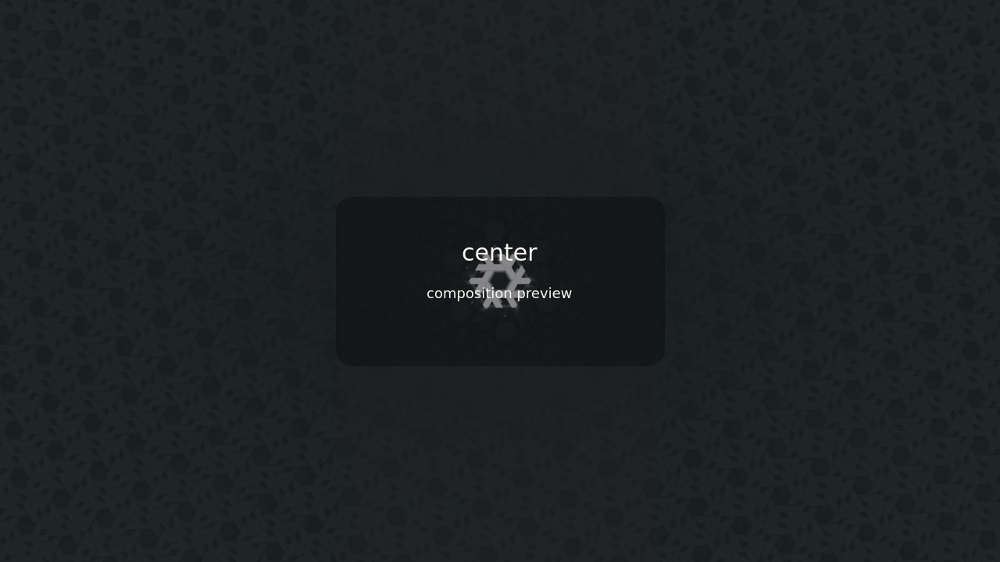 | 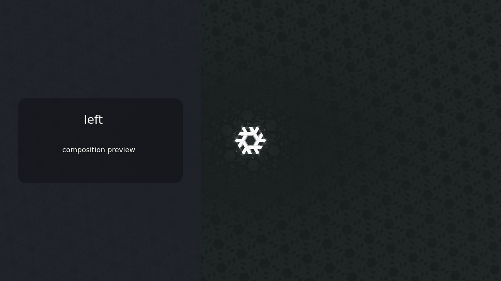 | 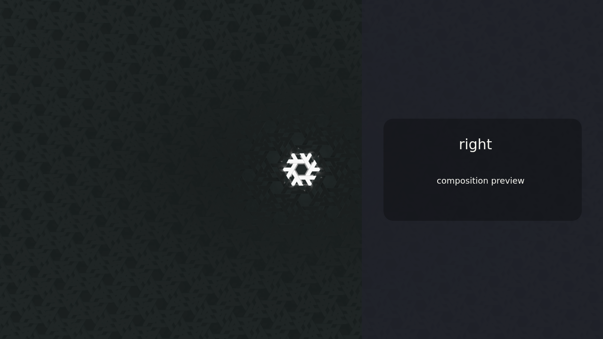 |

## Form Styles

The default form style is `blur`.

Available form styles:

- `solid`
- `blur`

## Advanced Options

The installer asks for these only if you choose to configure advanced options.
Nix users can set them directly, and every option has a default.
Color values accept Qt color strings in `#RRGGBB` or `#AARRGGBB` form.

| Option | Default | Values |
| --- | --- | --- |
| `background.dim` | `0.2` | Number from `0.0` to `1.0` |
| `background.color` | `#101820` | Qt color string, such as `#111827` or `#80262626` |
| `form.background.color` | `#80262626` | Qt color string, such as `#111827` or `#80262626` |
| `colors.text` | `#eeeeee` | Qt color string |
| `colors.mutedText` | `#999999` | Qt color string |
| `colors.accent` | `#66ccff` | Qt color string |
| `colors.input.background` | `#20242c` | Qt color string |
| `colors.button.background` | `#303846` | Qt color string |
| `form.blur.amount` | `2.4` | Number from `0.0` up to, but not including, `3.0` |
| `form.blur.max` | `60` | Number greater than or equal to `2` |
| `form.widthRatio` | `0.45` | Number greater than `0.0` and up to `1.0` |
| `font.size` | `13` | Positive number |
| `roundCorners` | `18` | Number greater than or equal to `0` |
| `clock.format` | `24h` | `24h`, `12h`, `iso`, `locale` |
| `clock.locale` | `en_US` | Locale string, such as `en_US` |
| `systemButtons.visible` | `false` | `true`, `false` |
| `virtualKeyboard.visible` | `false` | `true`, `false` |

## Backgrounds

The default background is `nixos-nineish-dark-gray`.
The default background placement is `fill`.

Backgrounds are discovered automatically from `Backgrounds/`. The background
ID is the filename without its extension, so `Backgrounds/neon-city.webp`
becomes `neon-city`.

Keep background IDs unique. For example, do not add both `neon-city.png` and
`neon-city.webp`.

Available background placements:

- `fill`
- `fit`
- `top`
- `bottom`
- `left`
- `right`
- `top-left`
- `top-right`
- `bottom-left`
- `bottom-right`

### Bundled Backgrounds

| `nixos-binary-black` | `nixos-binary-blue` | `nixos-catppuccin-macchiato` |
| --- | --- | --- |
| 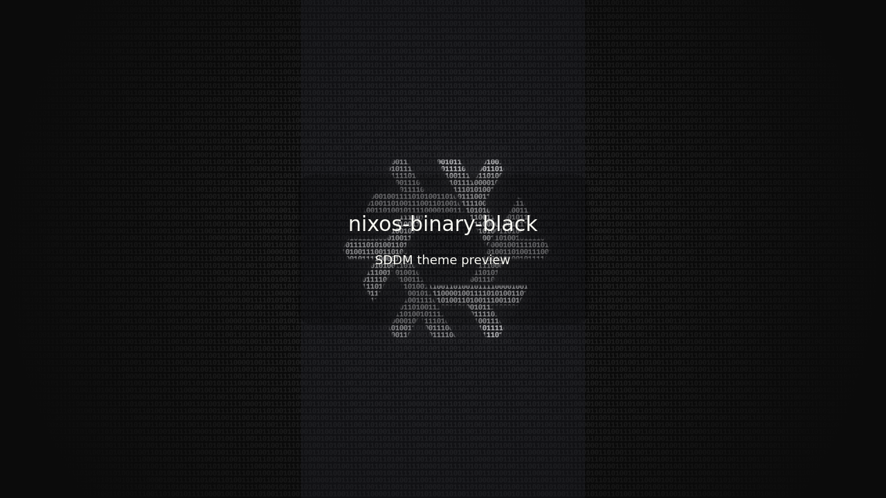 | 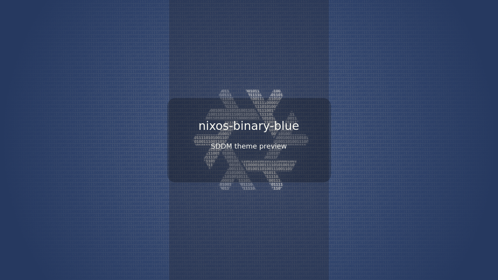 | 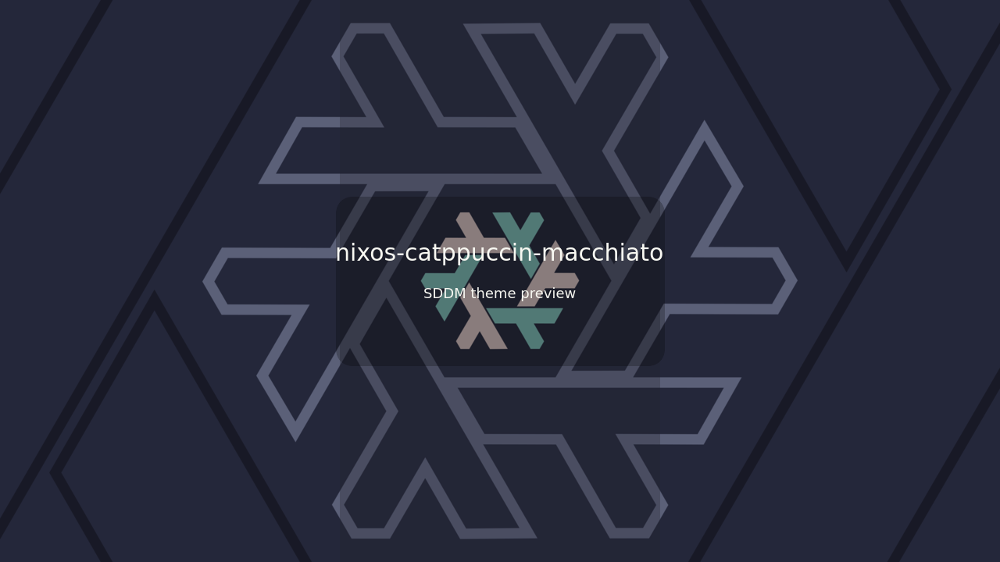 |

| `nixos-catppuccin-mocha` | `nixos-gear` | `nixos-moonscape` |
| --- | --- | --- |
| 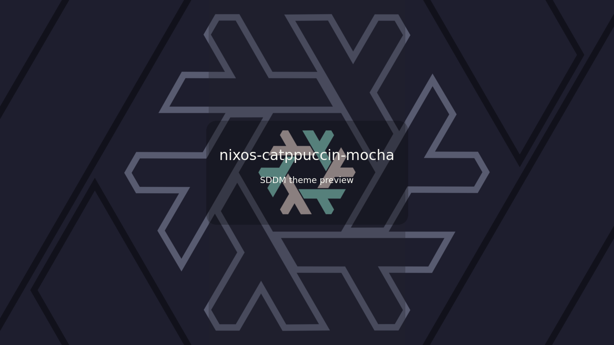 | 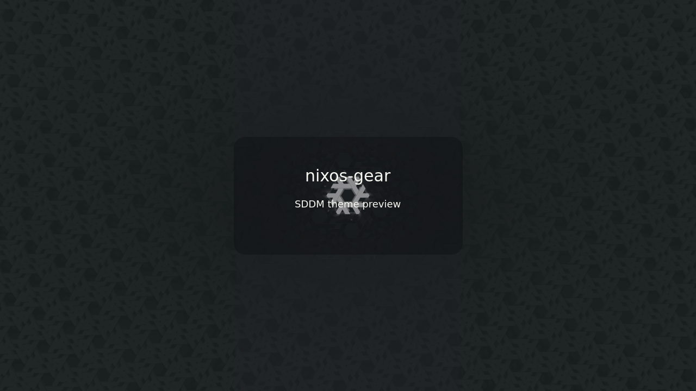 | 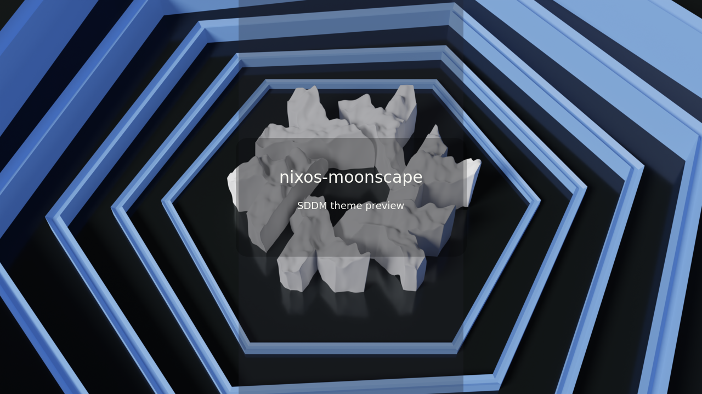 |

| `nixos-mosaic-blue` | `nixos-nineish-dark-gray` | `nixos-recursive` |
| --- | --- | --- |
| 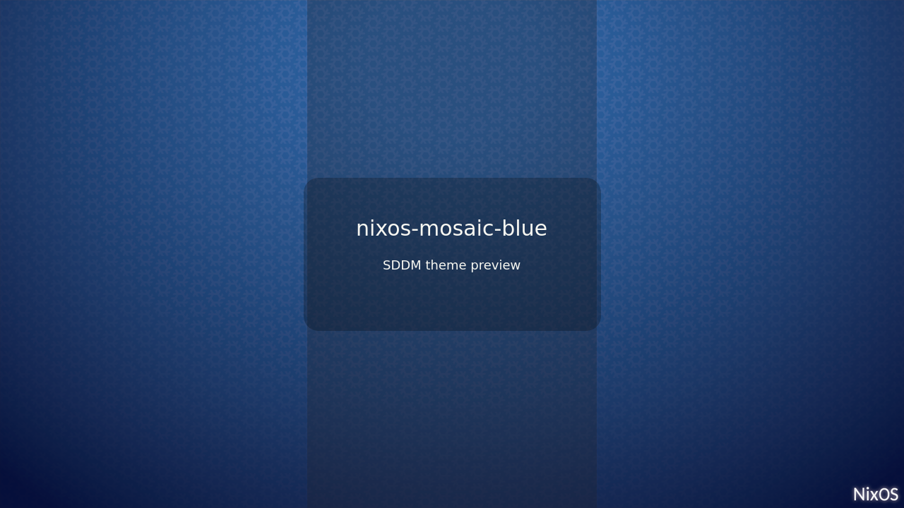 | 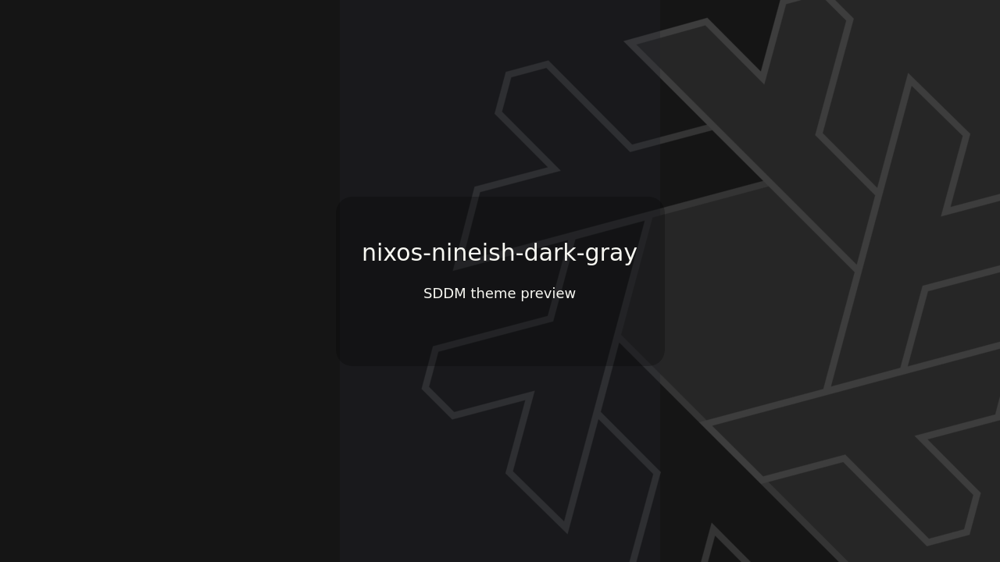 | 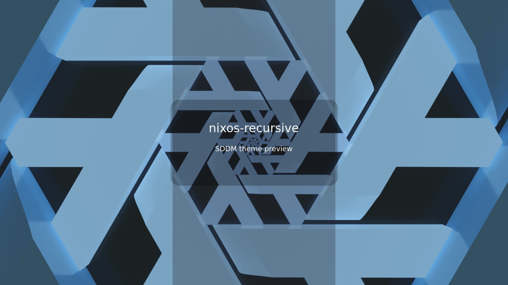 |

| `nixos-simple-dark-gray` | `nixos-waterfall` | `nixos-watersplash` |
| --- | --- | --- |
| 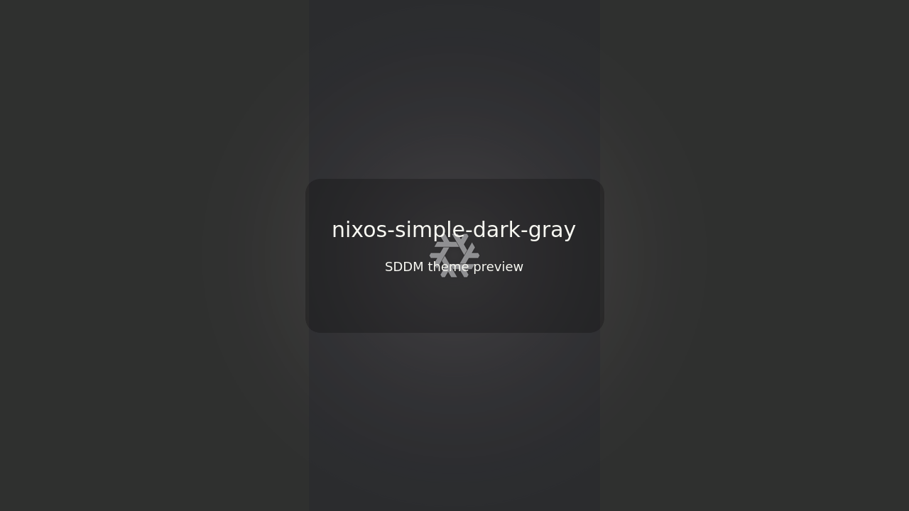 | 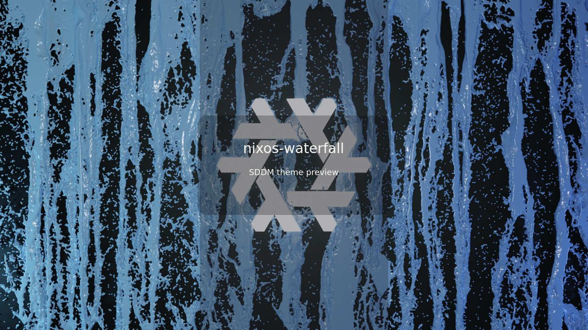 | 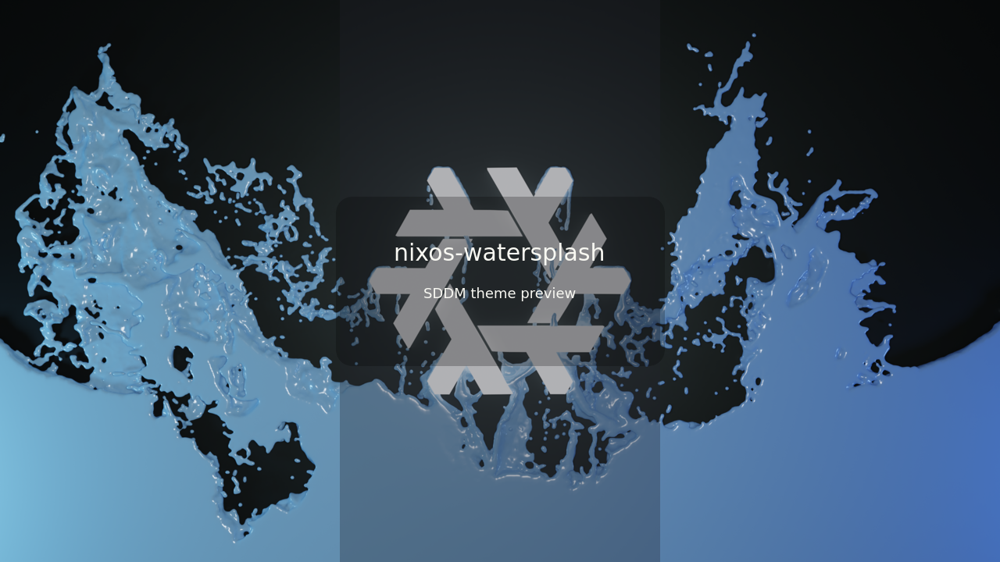 |

Supported background formats follow the upstream theme: `png`, `jpg`, `jpeg`,
`webp`, `gif`, `avi`, `mp4`, `mov`, `mkv`, `m4v`, and `webm`.

Add a background by placing a supported file in `Backgrounds/`. If you also add
`Previews/<background-id>.png`, SDDM metadata uses that preview image. Otherwise
static image backgrounds use the background itself as the screenshot, and video
backgrounds fall back to the default preview.

Generate static comparison previews for image backgrounds:

```sh
tools/preview-variants.sh
```

## Fonts

The default font is `Orbitron`.

Bundled font families:

| Family | Preview |
| --- | --- |
| `Open Sans` |  |
| `ArcadeClassic` |  |
| `ESPACION` | 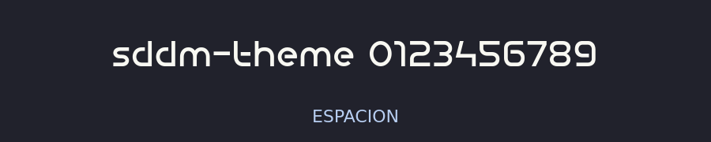 |
| `Electroharmonix` | 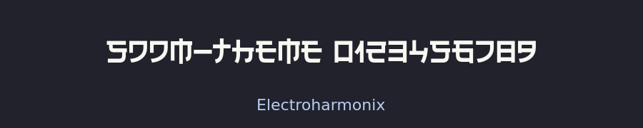 |
| `Fragile Bombers` |  |
| `Fragile Bombers Attack` |  |
| `Fragile Bombers Down` |  |
| `KogniGear` | 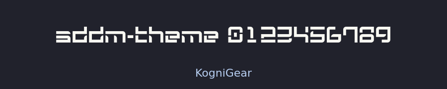 |
| `Orbitron` | 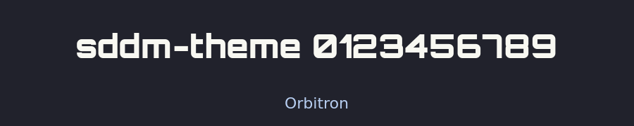 |
| `Pixelon` | 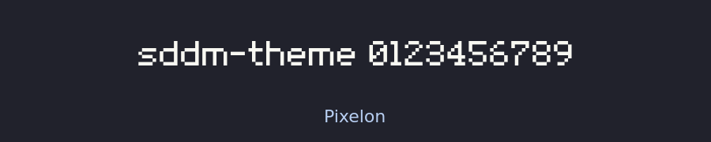 |
| `Thunderman` | 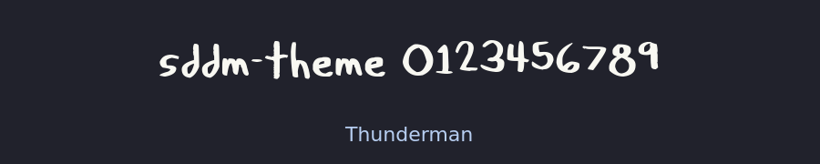 |

Regenerate font previews:

```sh
tools/preview-fonts.sh
```

## Nix Usage

Build the theme package:

```sh
nix build
```

Use it from another flake:

```nix
{
  inputs.sddm-theme.url = "github:W4T4r/sddm-theme";
}
```

Then install and select it in NixOS:

```nix
{ inputs, pkgs, ... }: {
  environment.systemPackages = [
    inputs.sddm-theme.packages.${pkgs.stdenv.hostPlatform.system}.default
  ];

  services.displayManager.sddm.theme = "sddm-theme";
}
```

When using the package directly, add the greeter runtime packages as SDDM extra
packages:

```nix
{ inputs, pkgs, ... }: {
  services.displayManager.sddm.extraPackages =
    inputs.sddm-theme.lib.sddmRuntimeDependencies pkgs;
}
```

Or import the included NixOS module and select theme options:

```nix
{ inputs, ... }: {
  imports = [
    inputs.sddm-theme.nixosModules.default
  ];

  services.sddmTheme = {
    enable = true;
    composition = "center";
    background = {
      name = "nixos-nineish-dark-gray";
      placement = "fill";
      dim = 0.2;
      color = "#101820";
    };
    colors = {
      text = "#eeeeee";
      mutedText = "#999999";
      accent = "#66ccff";
      input = {
        background = "#20242c";
      };
      button = {
        background = "#303846";
      };
    };
    form = {
      style = "blur";
      widthRatio = 0.45;
      background.color = "#80262626";
      blur.amount = 2.4;
      blur.max = 60;
    };
    font = {
      family = "Orbitron";
      size = 13;
    };
    roundCorners = 18;
    clock = {
      format = "24h";
      locale = "en_US";
    };
    systemButtons = {
      visible = false;
    };
    virtualKeyboard = {
      visible = false;
    };
  };
}
```

The module installs the theme package, sets
`services.displayManager.sddm.theme = "sddm-theme"`, generates
`Themes/selected.conf` from the selected options, and patches
`metadata.desktop` to point at it. It also adds the Qt runtime packages needed
by the greeter to `services.displayManager.sddm.extraPackages`.

## Manual Installation

Install dependencies:

- `sddm >= 0.21.0`
- `qt6 >= 6.8`
- `qt6-svg >= 6.8`
- `qt6-virtualkeyboard >= 6.8`
- `qt6-multimedia >= 6.8`

Clone this repository:

```sh
sudo git clone -b main --depth 1 https://github.com/W4T4r/sddm-theme.git /usr/share/sddm/themes/sddm-theme
```

Copy fonts:

```sh
sudo cp -r /usr/share/sddm/themes/sddm-theme/Fonts/* /usr/share/fonts/
```

Select the theme:

```sh
echo "[Theme]
Current=sddm-theme" | sudo tee /etc/sddm.conf
```

Enable the virtual keyboard:

```sh
sudo mkdir -p /etc/sddm.conf.d
echo "[General]
InputMethod=qtvirtualkeyboard" | sudo tee /etc/sddm.conf.d/virtualkbd.conf
```

Preview:

```sh
sddm-greeter-qt6 --test-mode --theme /usr/share/sddm/themes/sddm-theme/
```

The installer menu can also install the theme and select options interactively.
Advanced options are optional and can be skipped. When configured, the
installer asks for the same value-based settings as the Nix module, such as
`background.dim`, `background.color`, `form.background.color`,
`colors.*`, `form.blur.amount`, `form.blur.max`, `form.widthRatio`,
`font.size`, `roundCorners`, `clock.*`, `systemButtons.visible`, and
`virtualKeyboard.visible`.

```sh
./setup.sh
```

## License

Distributed under the GPL-3.0-or-later license.

This project is a modified work based on
[sddm-astronaut-theme](https://github.com/Keyitdev/sddm-astronaut-theme).

Bundled wallpapers retain their original licenses. See
[ATTRIBUTION.md](./ATTRIBUTION.md).
